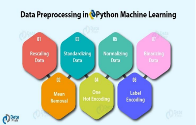

# Absenteeism-Prediction
A data science project to draw insights about absenteeism of employees and predict absenteeism frequency in future and the measures to solve them

### GOAL OF THE PROJECT
This project aims towards preprocessing , mode building , drawing insights and coming with the measures a company use to reduce the problem of absenteeism.

## Understanding the problem of Absenteeism
In this project , we will have thorough understanding absenteeism and how this is a major challenge for institutions and firms.

  

## Preprocessing of the dataset
We will be filtering the part of dataset which is useful for drawing insights by going through various methods of preprocessing using pandas and numpy.

  

## Model Building 
Model is build according the requirement and problem of the dataset.

  

## Drawing Insights 
This is the most important part of the project , identifying the meaningful intuitions.

  

## Conclusion and Measures
Coming up with solutions and measures to reduce the degree of this problem.

  

